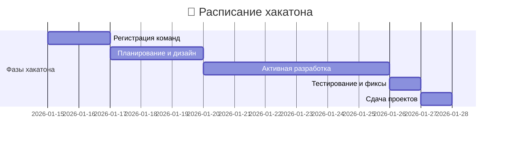
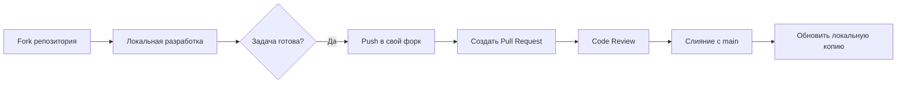

# Hakaton_knight-s-move_2026
repository of the hackathon project related to creating team projects for Academy Top students

# 🏆 Хакатон "Tower Defence Challenge" 🏰

<div align="center">


**[📍 Логотип Хакатона](hackathon-logo.png)**

</div>

## 🎯 Обзор хакатона

Добро пожаловать на самый захватывающий хакатон по созданию Tower Defence игры! За 2 недели вы создадите полноценную браузерную игру, освоите командную разработку на GitHub и получите ценные навыки, которые пригодятся в будущем.

### 🏅 Награды
| Категория | Награда | Дополнительно |
|-----------|---------|---------------|
| **Все участники** | 🪙 50 топ коинов | Оценки за уроки |
| **Победители** | 🪙 100 топ коинов | Премиальные оценки |
| **Особые номинации** | 🎖️ Дополнительные коины | Сертификаты |

## 📅 Ключевые даты



## 👥 Формирование команды

### Требования к команде:
- **Минимум:** 2 участника
- **Максимум:** 4 участника
- **Обязательно:** Разные роли и навыки

### 🎭 Роли в команде:

| Роль | Обязанности | Навыки |
|------|-------------|---------|
| **👨‍💻 Team Lead** | Управление проектом, координация, распределение задач | Лидерство, организация |
| **🎨 Frontend Developer** | Интерфейс, анимации, стилизация | HTML, CSS, дизайн |
| **⚙️ Game Developer** | Игровая логика, механики | JavaScript, алгоритмы |
| **📊 QA/Testing** | Тестирование, баг-репорты, баланс | Внимательность, аналитика |

> 💡 *Совет:* Один участник может совмещать несколько ролей, но важно распределить ответственность!

## 🚀 Начало работы

### Шаг 1: Создание команды
1. Найдите единомышленников (2-4 человека)
2. Определите роли каждого участника
3. Придумайте название команды и логотип

### Шаг 2: Настройка GitHub
```bash
# Для Team Lead:
1. Создать новый репозиторий на GitHub
2. Добавить файлы: index.html, style.css, game.js
3. Настроить Issues и Projects
4. Пригласить участников как collaborators

# Для участников:
1. Форкнуть основной репозиторий
2. Клонировать локально: git clone [your-fork-url]
3. Настроить upstream: git remote add upstream [main-repo-url]
```

### Шаг 3: Рабочий процесс Git
<div align="center">
  


</div>

## 🎮 Требования к игре

### ✅ Обязательные требования:
1. **Базовые механики Tower Defence:**
   - 🏰 Защищаемая база/территория
   - 👾 Волны противников с разными характеристиками
   - 🔫 Различные типы башен с уникальными способностями
   - 💰 Экономическая система (деньги, улучшения)
   - ❤️ Система здоровья/жизней

2. **Технические требования:**
   - Чистый JavaScript (без фреймворков)
   - Адаптивный дизайн (работа на ПК и планшетах)
   - Кроссбраузерная совместимость

3. **Уникальная механика:**
   - Собственная, нестандартная особенность игры
   - Примеры: комбинирование башен, временные эффекты, интерактивное окружение

### 🎨 Стилистика и дизайн:
- Единый визуальный стиль
- Собственная цветовая палитра
- Логотип игры и команды
- Анимации и эффекты

## 📋 Оценка проекта

### Критерии оценки (100 баллов):

| Категория | Макс. баллы | Что оценивается |
|-----------|-------------|-----------------|
| **Функциональность** | 30 | Работоспособность, уникальная механика, баланс |
| **Код и архитектура** | 25 | Чистота кода, структура проекта, Git история |
| **Дизайн и UI/UX** | 20 | Стилистика, анимации, удобство интерфейса |
| **Документация** | 15 | README, Wiki, описание команды |
| **Командная работа** | 10 | Распределение коммитов, Issues, коммуникация |

## 🛠️ Рекомендуемый стек технологий

<div align="center">


</div>

### 📚 Полезные ресурсы:
- **[MDN Web Docs](https://developer.mozilla.org/)** - документация по веб-технологиям
- **[GitHub Learning Lab](https://lab.github.com/)** - обучение Git и GitHub
- **[Coolors](https://coolors.co/)** - генератор цветовых палитр
- **[Game Dev Resources](https://github.com/ellisonleao/magictools)** - ресурсы для разработки игр

## 🎪 Инструменты для помощи

### 🤖 Разрешено использовать:
- **Нейросети** для генерации кода, дизайна, контента
- **Генераторы спрайтов и анимаций**
- **Библиотеки иконок и шрифтов**
- **Готовые звуковые эффекты** (с указанием источника)

> ⚠️ **Важно:** Все использованные инструменты должны быть указаны в документации!

## 📈 Дополнительные улучшения (бонусные баллы)

### 🚀 Примеры улучшений для максимизации баллов:

#### **Технические улучшения:**
- ✅ Progressive Web App (PWA) возможности
- ✅ Local Storage для сохранения прогресса
- ✅ Service Workers для оффлайн-режима
- ✅ WebGL/Canvas оптимизация графики

#### **Игровые улучшения:**
- 🎯 Несколько уровней сложности
- 🏆 Система достижений
- 📊 Статистика и рекорды
- 🔊 Оригинальный саундтрек и звуки

#### **Документационные улучшения:**
- 📖 Полное Wiki с гайдами
- 🎥 Видео-демонстрация игры
- 🧪 Юнит-тесты для ключевых функций
- 🌐 Мультиязычная поддержка

## 📊 Организация репозитория

### Структура проекта:
```
tower-defence-game/
├── 📁 assets/          # Графика, звуки, шрифты
│   ├── 📁 images/
│   ├── 📁 sounds/
│   └── 📁 fonts/
├── 📁 docs/           # Документация
├── 📁 src/            # Исходный код
│   ├── 📄 index.html
│   ├── 📄 style.css
│   └── 📄 game.js
├── 📄 README.md       # Этот файл
├── 📄 .gitignore
└── 📄 LICENSE
```

### GitHub Features для использования:
1. **📋 Projects** - для трекинга задач
2. **🐛 Issues** - для багов и идей
3. **📖 Wiki** - для документации
4. **🔀 Pull Requests** - для code review
5. **🏷️ Releases** - для версионирования

## 🤝 Коммуникация в команде

### Рекомендуемые практики:
1. **Ежедневные стендапы** (10-15 минут)
2. **Использование Issues** для всех задач
3. **Code Review** для каждого Pull Request
4. **Ведение changelog** изменений

### Шаблон для Issue:
```markdown
## Описание
[Краткое описание задачи]

## Тип задачи
- [ ] Баг
- [ ] Улучшение
- [ ] Новая функция

## Сложность
- [ ] Легкая
- [ ] Средняя
- [ ] Сложная

## Дополнительная информация
[Скриншоты, ссылки, идеи]
```

## 🏆 Призы и мотивация

<div align="center">

### 🪙 Система наград:

| Уровень | Топ коины | Дополнительные бонусы |
|---------|-----------|----------------------|
| 🥇 **1 место** | 100 | Сертификат победителя + приоритет в следующих проектах |
| 🥈 **2 место** | 80 | Сертификат призера + особое упоминание |
| 🥉 **3 место** | 60 | Сертификат призера |
| 🎖️ **Все участники** | 50 | Сертификат участника + опыт в портфолио |


</div>

## 📝 Чек-лист перед сдачей

### Обязательные пункты:
- [ ] Игра полностью работоспособна
- [ ] Уникальная механика реализована
- [ ] README.md заполнен полностью
- [ ] Wiki содержит документацию
- [ ] Все участники внесли коммиты
- [ ] Issues использованы для задач
- [ ] Логотип команды создан
- [ ] Репозиторий оформлен

### Рекомендуемые пункты:
- [ ] Добавлены скриншоты/гифки игры
- [ ] Создана страница "About Team"
- [ ] Добавлены комментарии в код
- [ ] Настроен GitHub Pages для демо
- [ ] Создан CHANGELOG.md

## 🚨 Важные правила

1. **Честность:** Все участники должны внести реальный вклад
2. **Сроки:** Проекты, сданные после 27.01.2026 23:59, не принимаются
3. **Оригинальность:** Плагиат и копирование чужих проектов запрещены
4. **Уважение:** Поддерживающая атмосфера в команде обязательна

## 📞 Контакты и поддержка

<div align="center">

### Нужна помощь?
| Вопрос по | Контакт | Время ответа |
|-----------|---------|--------------|
| **Техническим вопросам** | [Создать Issue](ссылка) | 24 часа |
| **Организационным вопросам** | [Ментор](mailto:mentor@example.com) | 48 часов |
| **Экстренные ситуации** | Telegram-чат хакатона | 2-4 часа |

**🎯 Помните:** Лучшая поддержка - это ваша команда и совместное решение проблем!


</div>

---

<div align="center">

## 🚀 Готовы к вызову?

**Старт:** 15 января 2026 года  
**Финиш:** 27 января 2026 года  

🌟 **Удачи, команды! Покажите, на что вы способны!** 🌟

**[⬆️ Вернуться к началу](#-хакатон-tower-defence-challenge-)** • **[📋 Скачать чек-лист](checklist.pdf)**


</div>

---

## 📋 Приложение: Шаблон README для вашего проекта

```markdown
# [Название вашей игры] 🏰

## 👥 Команда "[Название команды]"

| Участник | Роль | Вклад | Контакты |
|----------|------|-------|----------|
| Имя 1 | Team Lead | Описание | [GitHub](link) |
| Имя 2 | Frontend Dev | Описание | [GitHub](link) |
| Имя 3 | Game Dev | Описание | [GitHub](link) |
| Имя 4 | QA/Testing | Описание | [GitHub](link) |

## 🎮 О проекте
[Описание вашей игры, концепция, уникальные особенности]

## 🚀 Быстрый старт
1. Клонировать репозиторий: `git clone [url]`
2. Открыть `index.html` в браузере
3. Играть!

## 🛠️ Технологии
- HTML5
- CSS3 (Flexbox/Grid, анимации)
- Vanilla JavaScript
- GitHub для коллаборации

## 🎯 Особенности игры
- Уникальная механика: [описание]
- [Другие особенности]

## 📁 Структура проекта
[Описание структуры]

## 🤝 Вклад участников
[Подробное описание вклада каждого]

## 📄 Лицензия
[MIT License]

## 🙏 Благодарности
[Благодарности, использованные ресурсы]
```
